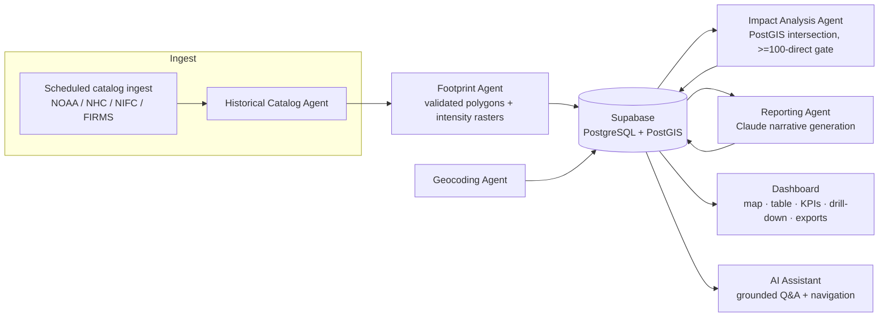

# FACIA — Catastrophe Impact Analytics (Showcase)

> Part of [`insurance-ai-lab`](https://github.com/mishraabhishek1218/insurance-ai-lab) — Catastrophe Intelligence Platform (⭐ P0).

**This is a trimmed, public showcase of a proprietary product.** Full source is private. This repo contains architecture notes, a demo link, and illustrative code snippets only — not the working application. See [LICENSE.md](./LICENSE.md).

A catastrophe impact analytics platform for P&C insurance carriers.

## Problem

When a hurricane, wildfire, or severe convective storm hits, catastrophe teams hunt for footprints across NHC, NWS, and radar products, paste them into GIS tools, and manually cross-check which insured properties were exposed — often days after the event, and repeated from scratch for every historical lookback. FACIA replaces that ad hoc process with a single map-first workflow: pick a year (or the live current year) → pick an event → see accurate multi-layer footprints → automatically surface exposed policies.

## Approach

FACIA runs in two complementary modes over the same catalog: **Historical** (CONUS events from 2020 through last year) and **Live** (the current calendar year, refreshed on a schedule). Both modes share multi-layer event footprints — wildfire, tropical cyclone, severe convective storm (wind/hail), flood, and tornado — sourced from NHC, NIFC/FIRMS, NOAA MRMS/URMA, and NWS. When a footprint directly intersects 100 or more policies in the uploaded portfolio, the platform automatically runs Deep Analysis: PostGIS-driven impact counts, intensity-at-location, and an AI-generated narrative report.

The system is built as a set of domain agents (geocoding, footprint generation, historical catalog ingest, impact analysis, reporting) that each own a bounded responsibility and communicate through durable database records rather than calling each other directly — every agent run is logged and auditable.

## Tech Stack

- **Frontend:** React + TypeScript (Vite), Mapbox GL JS, TanStack Query, Zustand
- **Backend:** Python FastAPI, background workflows, OpenAI-powered chat assistant
- **Database:** Supabase PostgreSQL + PostGIS
- **Reporting:** Anthropic Claude API for narrative generation
- **Deployment:** Vercel (frontend), Render (backend + scheduled catalog ingest)

## Live Demo

[facia-dashboard.vercel.app](https://facia-dashboard.vercel.app)

## Architecture

Every agent reads and writes durable records in Supabase rather than calling other agents directly — the database is the source of truth and the audit trail. The dashboard and AI Assistant are both read/write clients of that same state, not a separate pipeline.

## Code samples

A few small, illustrative excerpts from the real codebase (trimmed, not full files):

- [`snippets/impact_analysis_contract.py`](./snippets/impact_analysis_contract.py) — the typed Pydantic input/output contract every domain agent exposes
- [`snippets/deep_analysis_gate.py`](./snippets/deep_analysis_gate.py) — per-event (not per-hazard) eligibility gating for Deep Analysis, enforced server-side
- [`snippets/bulk_direct_impact.sql`](./snippets/bulk_direct_impact.sql) — a bulk PostGIS intersection function backing a catalog-list filter

---

© 2026 Abhishek Mishra. All rights reserved.
